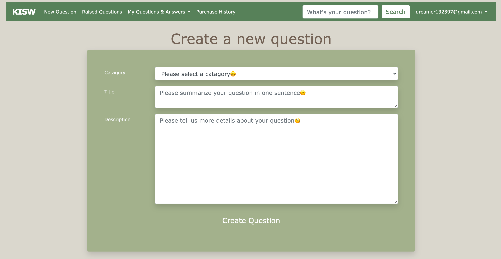

# README--KISW

## Identification of the problem you are trying to solve by building this particular marketplace app.
In the process of establishing the program, there are mainly the following problems:
1. The front-end format is not applied to all pages, so logical statements are needed to handle the difference in format.
2. The design of the data schema. The relationship between the user and the question and answer needs to be considered. Especially the question is visible to everyone, but the answer is not.
3. Whether the rails version is compatible with the gem version. Such as bootstrap and rails6

The current problem is that users cannot search for similar problems based on keywords.Users can only browse all questions and manually view the related questions. In addition, the absence of a classification system also causes inconvenience to the user experience.
Payment function has not been established。
## Why is it a problem that needs solving?
Because the user's question is not answered in time. Users can take a simpler way to check the answers to similar questions.Especially when the database is large enough, it is impossible to just look at the answers to your own questions.
Payment part will be finish soon.
## A link (URL) to your deployed app (i.e. website)
https://kisw.herokuapp.com/
## A link to your GitHub repository (repo).
https://github.com/jingzhao-git/KISW

## Description of your marketplace app (website), including:
- Purpose

Let more people understand the importance of paying for knowledge.
Make your own problems more likely to be helped by others through rewards.

- Functionality / features

User registration is not an administrator by default. Only by entering the console can be set as an administrator. The administrator can see the categories in the navigation bar and create categories.
Users can create and answer questions
The newly created question, only the questioner and the administrator have the authority to edit and delete
All users can view the created questions
All users can leave an answer to each question

- Sitemap

- Screenshots

- Target audience

The target user is anyone who wants to ask questions, whether it is an office worker or a student or a housewife. In addition, it also provides a platform for people who like to answer questions and want to make money from their own knowledge

- Tech stack (e.g. html, css, deployment platform, etc)

html, css, js, heroku, bootstrap, postgresql, authentication

## User stories for your app
The user dreamer registers and logs in to the website via email. After logging in, you can view all the questions (including his own and other people's). And he can add answers to these questions. He can create a new question through new question and wait for others to answer, and he can choose the category when asking questions. He can change or delete the questions he has asked, but he cannot change or delete other people's questions. He can also delete his answer.
## Wireframes for your app

## An ERD for your app

## Explain the different high-level components (abstractions) in your app
Questions and answers are a more complicated part of the authority, which needs to take into account the different needs and security issues of various users
## Detail any third party services that your app will use
bootsrap, stripe，erd
## Describe your projects models in terms of the relationships (active record associations) they have with each other/Discuss the database relations to be implemented in your application/Provide your database schema design

Users have a one-to-many relationship to problems.

User to answer is one-to-many

The answer to the question is a one-to-many relationship

The problem is a many-to-many relationship for payment orders

## Describe the way tasks are allocated and tracked in your project
The operation of the project is mainly based on the MVC structure. These are all of the controllers used: application, welcome, questions, answers, catagories and users.Among them, welcome is just a home page with no entity relationship, so there is no model. For the entities including quetion, answer, catagory and user, they all have corresponding models. Furthermore, these controllers all have views part. There are also some html.erb files to assist the front end. When the user performs operations on the view interface, such as asking questions, find the corresponding questions_controller through routes. Then use the question model to call the database to add the new question to the database (also the ID and time of the questioner). Finally, the question model returns the data to questions_controller and displays it to the user through quetions.html.erb

